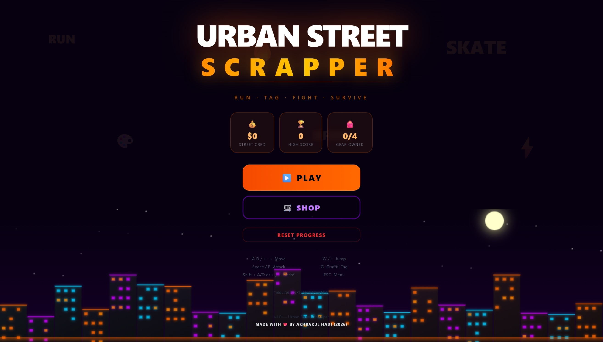
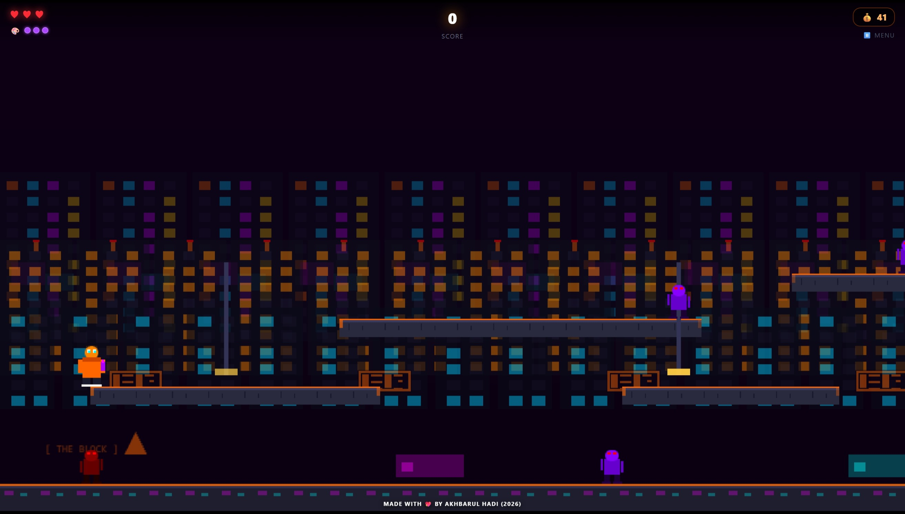
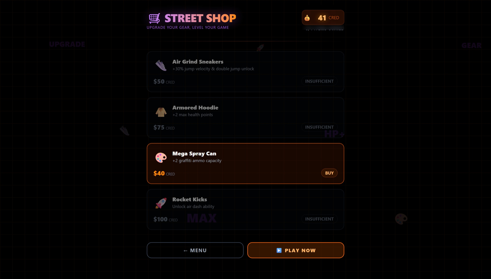

<div id="top"></div>

# <p align="center">✨ Urban Street Scrapper ✨</p>
<p align="center">
   
<div align="center"> 
    <h1> 
       
    </h1>
</div>

<div align="center">
  <!-- Application Logo -->
  
</div>

 <h2>Hi there👋, Welcome to Urban Street Scrapper! </h2>

<p>
A fast-paced, web-based 2D action/platformer game built with modern web technologies. Embark on a street adventure where players earn <em>Street Cred</em>, upgrade their stats in the in-game shop, and score points. The game features a secure, tamper-proof save system to ensure a fair and competitive environment.
</p>

<!--line-->


<h2>Table of Contents🧾</h2>

- [Overview📌](#overview)
- [Key Features🚀](#key-features)
- [Tech Stack💻](#tech-stack)
- [Demo🌐](#demo)
- [Installation⚙️](#installation)
- [Creator⚡](#creator)

<br>
<!--line-->


<h2 id="overview">Overview📌</h2>

<p>
This project integrates a robust HTML5 game engine (Phaser) inside a React/Next.js environment, delivering a seamless web gaming experience. Key objectives include:
</p>

<ol>
  <li>
    <strong>Engaging Gameplay:</strong> Action-packed mechanics where players can collect points, manage health, use graffiti ammo, and unlock abilities like double jump or air dash.
  </li>
  <li>
    <strong>In-Game Economy & Shop:</strong> Players can spend their earned Street Cred to buy upgrades (e.g., Air Grind Sneakers, Armored Hoodie, Rocket Kicks).
  </li>
  <li>
    <strong>Tamper-Proof Save System:</strong> Uses JSON Web Tokens (JWT) via Next.js Server Actions to sign the game state. This prevents players from cheating by manually altering their score or inventory in the browser's Local Storage.
  </li>
</ol>


<!--line-->


<h2 id="key-features">Key Features🚀</h2>
<ul>
  <li>🎮 <strong>Phaser Game Engine:</strong> Smooth 2D gameplay running natively in the browser.</li>
  <li>🛒 <strong>Dynamic Upgrade Shop:</strong> Interactive store for buying stat boosts and abilities.</li>
  <li>🔒 <strong>Anti-Cheat Save States:</strong> JWT-based data signing ensures Local Storage data cannot be manipulated.</li>
  <li>⚡ <strong>Modern React UI:</strong> Game HUD and menus built with React Context, <code>useReducer</code>, and Tailwind CSS.</li>
  <li>🚀 <strong>Next.js App Router:</strong> Fast rendering, server actions for security, and optimized assets.</li>
</ul>

<p align="right"><a href="#top"></a></p>

<!--line-->


<h2 id="tech-stack">Tech Stack💻</h2>

* **Framework:** [Next.js 16](https://nextjs.org/) (App Router)
* **Game Engine:** [Phaser 4](https://phaser.io/)
* **Language:** TypeScript
* **Styling:** Tailwind CSS (v4)
* **State Management:** React Context API & `useReducer`
* **Security (Anti-Cheat):** `jose` (JWT Signing & Verification)

<p align="right"><a href="#top"></a></p>

<!--line-->


<h2 id="demo">Demo🌐</h2>

<h3>🌐 Live Web Demo</h3>
<p>
  You can try out the live web game here: 
  <strong><a href="https://urban-street-scrapper.vercel.app/">urban-street-scrapper.vercel.app</a></strong>
</p>

<h3>📸 Screenshots</h3>
<p align="center">
  <b>Main Menu</b><br>
  
</p>
<p align="center">
  <b>Action Gameplay</b><br>
  
</p>
<p align="center">
  <b>In-Game Shop</b><br>
  
</p>

<p align="right"><a href="#top"></a></p>

<!--line-->


<h2 id="installation">Installation⚙️</h2>

### 1. Clone the repository
```bash
git clone https://github.com/akhbarulhadi/urban-street-scrapper.git
cd urban-street-scrapper
```

### 2. Install dependencies
```bash
npm install
```

### 3. Environment Variables
Create an `.env` file in the root directory and configure the following keys:

```bash
cp .env.example .env
```

```env
# SERVER-SIDE: Digunakan untuk sign/verify JWT
JWT_SECRET_KEY="your_super_secret_random_string_here"

# CLIENT-SIDE: Nama key untuk menyimpan token di Local Storage browser
NEXT_PUBLIC_LOCAL_STORAGE_KEY="urbanStreetScrapper"
```

### 4. Run the Development Server
```bash
npm run dev
```

<p align="right"><a href="#top"></a></p>

<!--line-->


<div align="center">
  
<h2 id="creator">Creator </h2>

<table>
<tr>
<td align="center"><a href="https://github.com/akhbarulhadi"></a></br> <h4 style="color:red;">Akhbarul Hadi</h4>
 <a href="https://github.com/akhbarulhadi"></img></a>
</td>
</tr>
</table>
  
</div>

<p align="right"><a href="#top"></a></p>

<!--line-->

